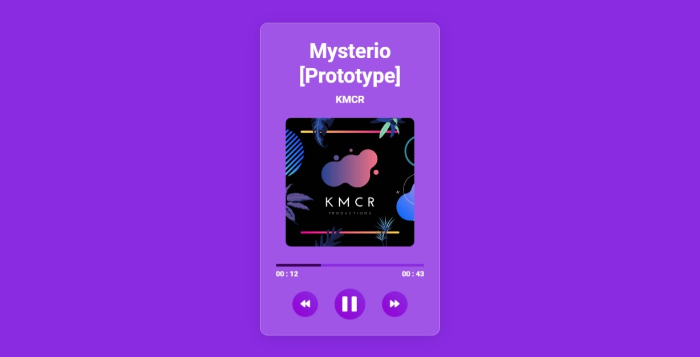

# Music Player

Simple web music player page with play/pause and previous/next functions.

<h3 align="center">
        
    </h3>

## Stack used

**Front-end:** HTML, CSS, Javascript

## Licença

[MIT](https://choosealicense.com/licenses/mit/)
